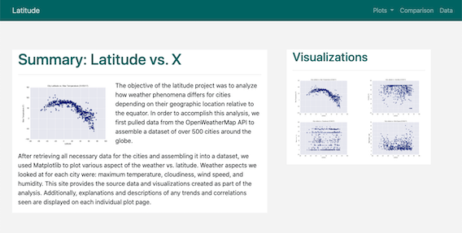
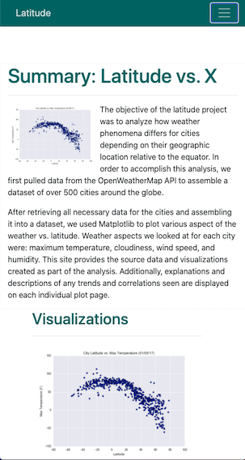
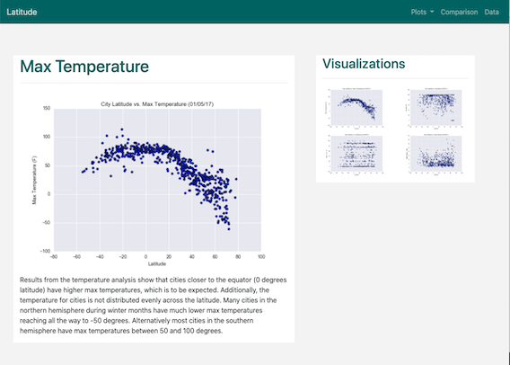
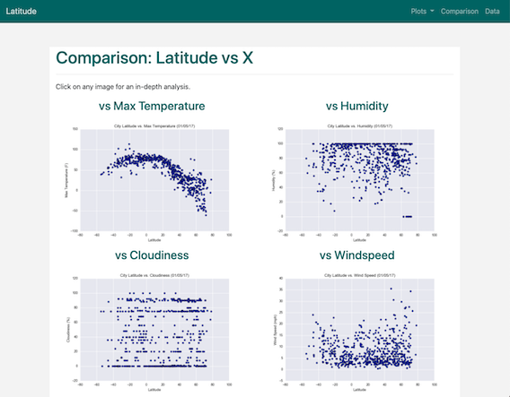
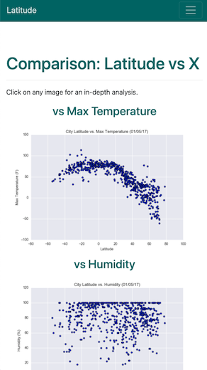
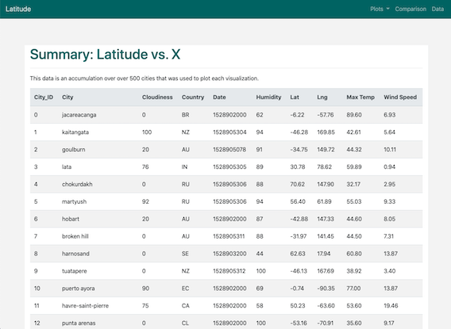

# Web-Design-Challenge

Deployed link: https://alplky.github.io/Web-Design-Challenge/index.html

## Background
In order to share what we've learned through previous data analysis, the best way to get it out into the world is through a visualization dashboard. The visualizations were first created when weather data was analyzed using API calls from OpenWeatherMaps. The dashboard has a landing page, individual pages for each plot, a data page, and a comparison page to view all 4 plots at once. Each page has a navigation bar in order to navigate between all 7 pages.  

## Technologies Used
- HTML
- CSS
- Boostrap
- Pandas

## Objectives
1. Create a navigation menu for every page using Bootstrap.

2. Create the following pages:
    - Landing page
    - 4 visualization pages for each plot
    - Comparisons page for all 4 plots
    - Data page that displays a responsive table 

3. Use CSS to style different aspects of the pages.

### Navigation Menu:
Each page has an identical responsive navigation bar that formats to larger and smaller screens depending on screen width. Each link label in the menu and drop down will take a user to the corresponding page. When collapsed, the navigation bar and drop-down menu continue to work as normal. 

### Landing Page
The landing page describes the project in-depth and includes a sidebar of images that link to each plot's page. 

 


### Visualization Pages
Each plot has it's own respective page that includes an image of the plot accompanied with a summary of the findings in analysis. Each plot page also has a side bar of plot images that link to each page. 



### Comparison Page
The comparison page consistist of images of all 4 plots. Each image is a link to the respective plots individual page. When the width of the page is small, each plot is viewed alone.




### Data Page
The data page was created by converting the CSV of city data into an HTML file using Pandas. 

```python
#set up dependencies
import pandas as pd

# import csv file
data = pd.read_csv("WebVisualizations/Resources/cities.csv")

# convert to html
data.to_html("WebVisualizations/Resources/cities.htm", index=False)
```
Once converted, the Bootstrap table class was added in order to apply formating and responsiveness. 



### CSS Styling
For stying choices, CSS was used on the navbar and various elements throughout the pages. 

```css
/* navbar color */
.navbar-custom { 
    background-color: rgb(4, 110, 110) !important; 
}

/* navbar-brand text color */
.navbar-custom .navbar-brand,
.navbar-custom .navbar-text {
    color: rgba(255,255,255,.8);
}

/* text color change for active links when hovered over*/
.navbar-custom .nav-item.active .nav-link,
.navbar-custom .nav-item:focus .nav-link,
.navbar-custom .nav-item:hover .nav-link {
    color: white;
}

/* drop down text formatting */
.navbar-custom .dropdown-item {
    color: black;
}

/* drop down highlight formatting when hovered over */
.navbar-custom .dropdown-item:hover,
.navbar-custom .dropdown-item:focus {
    color: #333333;
    background-color: rgb(186, 197, 197);
}

/* background color for main container on landing page*/
.col-md-8,.col-sm-12 {
    background-color: white;
}

/* background color for vizualizations container */
.col-md-4,.col-sm-12 {
    background-color: white;
}

/* font color for titles in each page */
.h1 {
    color: rgb(4, 110, 110); 
}

/* font folor for visualzation title on each page */
.h2 {
    color: rgb(4, 110, 110); 
}

/* background color to differ from containers */
body { 
    padding-top: 130px;
    background-color: whitesmoke;
}

/* title font color and alignment for comparison page visualizations */
.h3 {
    color: rgb(4, 110, 110); 
    text-align: center;
}

/* container color for comparisons page */
#compbox {
    background-color: white;
}

/* sizing and position for visualization box */
.box {
  float: right;
  height: 300px;
  width: 375px;
  margin-bottom: 15px;
  margin-left: 50px;
  background-color: white;
}

/* highlights border of images when hovered over */
.thumbnail:hover {
  border: solid 5px rgb(4, 110, 110);
  margin: -5px; 
}

/* Background color changes depending on screen width */
@media screen and (max-width: 900px) {
    body{
        background-color: #FFFFFF;
    }
}
```
